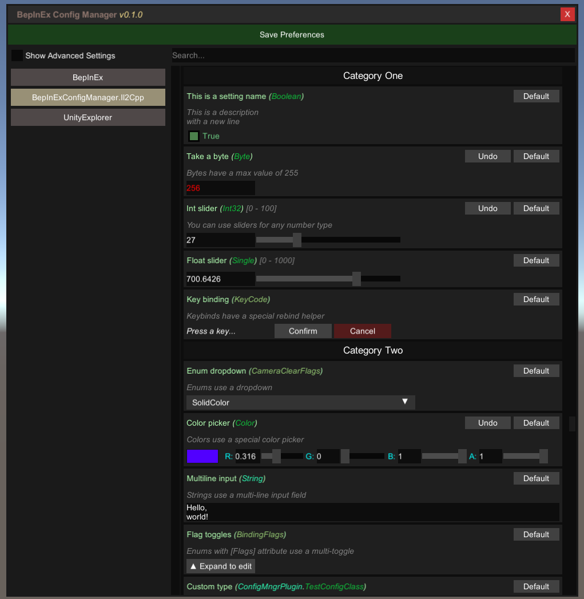

# BepInExConfigManager

In-game UI for managing BepInEx Configurations, for IL2CPP and Mono Unity games.

Requires BepInEx 6 for IL2CPP, and BepInEx 5 for Mono.

✨ Powered by [UniverseLib](https://github.com/sinai-dev/UniverseLib)

## Releases [](../../releases/latest)

* [Download (IL2CPP)](https://github.com/sinai-dev/BepInExConfigManager/releases/latest/download/BepInExConfigManager.Il2Cpp.zip)
* [Download (Mono)](https://github.com/sinai-dev/BepInExConfigManager/releases/latest/download/BepInExConfigManager.Mono.zip)

## How to use

* Put the DLL in your `BepInEx\plugins\` folder.
* Start the game and press `F5` to open the Menu.
* You can change the keybinding under the `BepInExConfigManager` category in the Menu, or by editing the file `BepInEx\config\com.sinai.BepInExConfigManager.cfg`.

[](https://raw.githubusercontent.com/sinai-dev/BepInExConfigManager/master/img/preview.png)

## Common issues and solutions

Although this tool should work out of the box for most Unity games, in some cases you may need to tweak the settings for it to work properly.

To adjust the settings, open the config file: `BepInEx\config\com.sinai.bepinexconfigmanager.cfg`

Try adjusting the following settings and see if it fixes your issues:
* `Startup_Delay_Time` - increase to 5-10 seconds (or more as needed), can fix issues with UnityExplorer being destroyed or corrupted during startup.
* `Disable_EventSystem_Override` - if input is not working properly, try setting this to `true`.

If these fixes do not work, please create an issue in this repo and I'll do my best to look into it.

## Info for developers

### Advanced (hidden) settings

This config manager supports advanced settings, defined either with the `ConfigurationManagerAttributes` tag or with a simple `"Advanced"` tag.

Simple method ("Advanced" string tag):
```csharp
Config.Bind("Section", "Hidden setting", true, new ConfigDescription("my description", null, "Advanced"));
```

Advanced method (official attributes class):
* You will need to include the `ConfigurationManagerAttributes` class in your project as outlined [here](https://github.com/BepInEx/BepInEx.ConfigurationManager#overriding-default-configuration-manager-behavior)
* I have not implemented any other attributes from the class, but I may at some point if there is enough demand.
```csharp
Config.Bind("Section", "Advanced setting", true, new ConfigDescription("my description", null,
    new ConfigurationManagerAttributes() { IsAdvanced = true }));
```

### Setting type support

The UI supports the following types by default:

* Toggle: `bool`
* Number input: `int`, `float` etc (any primitive number type)
* String input: `string`
* Key binder: `UnityEngine.KeyCode` or `UnityEngine.InputSystem.Key`
* Dropdown: `enum` or any setting with `AcceptableValueList`
* Multi-toggle: `enum` with `[Flags]` attribute
* Color picker: `UnityEngine.Color`
* Struct editor: `UnityEngine.Vector3`, `UnityEngine.Quaternion`, etc
* Toml input: Anything else with a corresponding TypeConverter registered to `BepInEx.Configuration.TomlTypeConverter`.

#### Sliders
To make a slider, use a number type and provide an `AcceptableValueRange` when creating the entry. For example:
```csharp
Config.Bind("Section", "Int slider", 32, new ConfigDescription("You can use sliders for any number type",
        new AcceptableValueRange<int>(0, 100))); 
```

#### Dropdowns

Dropdowns are used for `enum` types, as well as any setting with an `AcceptableValueList` provided.

If you use an `AcceptableValueList` it will override any other UI handler and force it to be a dropdown.

```csharp
Config.Bind(new ConfigDefinition("Section", "Some list"), "One", new ConfigDescription("An example of a string list",
        new AcceptableValueList<string>("One", "Two", "Three", "Four", "etc..."))); 
```

#### Custom UI Handlers
You can override the Toml input for a Type by registering your own InteractiveValue for it. Refer to [existing classes](https://github.com/sinai-dev/BepInExConfigManager/tree/main/src/UI/InteractiveValues) for more concrete examples.
```csharp
// Define an InteractiveValue class to handle 'Something'
public class InteractiveSomething : InteractiveValue
{
    // declaring this ctor is required
    public InteractiveSomething(object value, Type fallbackType) : base(value, fallbackType) { }

    // you could also check "if type == typeof(Something)" to be more strict
    public override bool SupportsType(Type type) => typeof(Something).IsAssignableFrom(type);

    // override other methods as necessary
}

// Register your class in your BasePlugin.Load method:
public class MyMod : BepInEx.IL2CPP.BasePlugin
{
    public override void Load()
    {
        InteractiveValue.RegisterIValueType<InteractiveSomething>();
    }
}
```
